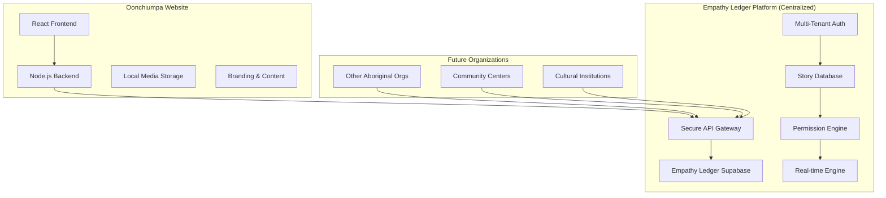

# 🎭 Empathy Ledger Integration Architecture
## World-Class Shared Platform Service for Oonchiumpa

### **Executive Summary**
Empathy Ledger as a **centralized shared platform service** provides Aboriginal communities with unprecedented control over their storytelling. Oonchiumpa will be the **flagship implementation**, demonstrating world-class integration patterns that future organizations will follow.

---

## 🏗️ **Architecture Overview**



---

## 🔐 **1. Multi-Tenant Security Model**

### **Organization-Level Isolation**
```javascript
// Each organization has secure API access
const empathyLedgerClient = new EmpathyLedgerClient({
  organizationSlug: 'oonchiumpa',
  apiKey: process.env.EMPATHY_LEDGER_API_KEY, // Scoped to Oonchiumpa
  endpoint: 'https://empathy-ledger.supabase.co'
});
```

### **Tenant-Aware RLS Policies**
```sql
-- Stories are isolated by organization
CREATE POLICY "org_story_isolation" ON stories
  FOR ALL USING (
    organization_id IN (
      SELECT id FROM organizations 
      WHERE slug = current_setting('app.current_organization')
    )
  );
```

### **API Key Management**
- **Organization-scoped keys** with specific permissions
- **Rate limiting** per organization
- **Usage analytics** and monitoring
- **Key rotation** capabilities

---

## 🎛️ **2. Storyteller Control Integration**

### **Sacred Toggle Implementation**
The core Empathy Ledger principle - storytellers can turn stories on/off instantly:

```typescript
// Frontend component
const StoryToggle = ({ story }) => {
  const [isActive, setIsActive] = useState(story.is_active);
  
  const handleToggle = async (newState: boolean) => {
    // Direct call to Empathy Ledger
    await empathyLedger.toggleStoryVisibility(story.id, newState);
    
    // Real-time update for all connected clients
    setIsActive(newState);
  };
  
  return (
    <Toggle
      checked={isActive}
      onChange={handleToggle}
      label={isActive ? '👁️ Visible' : '🔒 Hidden'}
    />
  );
};
```

### **Permission Granularity**
```typescript
interface StoryPermissions {
  visibility_level: 'private' | 'community' | 'organization' | 'network' | 'public';
  control_level: 'full_control' | 'collaborative' | 'guided' | 'protected' | 'locked';
  can_share: boolean;
  can_download: boolean;
  can_translate: boolean;
  requires_cultural_approval: boolean;
  elder_approval_required: boolean;
}
```

### **Real-Time Synchronization**
```typescript
// Instant updates across all connected clients
supabase
  .channel('story-changes')
  .on('postgres_changes', 
    { event: 'UPDATE', schema: 'public', table: 'stories' },
    (payload) => {
      // Update UI immediately when storyteller toggles visibility
      updateStoryInUI(payload.new);
    }
  )
  .subscribe();
```

---

## 🔗 **3. Data Integration Patterns**

### **Hybrid Data Architecture**
```javascript
// Oonchiumpa stores local content, Empathy Ledger handles storyteller control
const story = {
  // Stored in Empathy Ledger (centralized)
  id: 'EL24ABC123',
  storyteller_id: 'uuid',
  title: 'My Journey',
  content: 'Story content...',
  is_active: true,           // 🎭 Sacred storyteller control
  visibility_level: 'community',
  cultural_sensitivity: 'medium',
  
  // Stored locally in Oonchiumpa (customized)
  local_branding: {
    featured_image: '/local-images/story-hero.jpg',
    custom_styling: { theme: 'earth-tones' },
    organization_tags: ['youth-program', 'success-story']
  },
  
  // Linked references
  related_outcomes: ['outcome-uuid-1', 'outcome-uuid-2'],
  media_gallery: ['media-1.jpg', 'media-2.mp4']
};
```

### **API Integration Patterns**

#### **1. Story Creation Flow**
```typescript
// 1. Create in Empathy Ledger (gets global ID & permissions)
const empathyStory = await empathyLedger.createStory({
  storyteller_id: storytellerId,
  organization_id: 'oonchiumpa',
  title: 'My Story',
  content: storyContent,
  cultural_context: 'Traditional knowledge',
  visibility_level: 'community'
});

// 2. Store local references and media
const localStory = await oonchiumpaDB.stories.create({
  empathy_ledger_id: empathyStory.empathy_ledger_story_id,
  featured_image_url: uploadedImageUrl,
  organization_tags: ['success-story'],
  related_programs: ['youth-engagement']
});

// 3. Link and sync
await empathyLedger.linkLocalContent(empathyStory.id, {
  organization: 'oonchiumpa',
  local_id: localStory.id,
  media_urls: [uploadedImageUrl]
});
```

#### **2. Story Display Flow**
```typescript
// Fetch with permissions check
const getStoryForUser = async (storyId: string, userId: string) => {
  // 1. Check Empathy Ledger permissions
  const story = await empathyLedger.getStory(storyId, {
    viewer_id: userId,
    organization: 'oonchiumpa'
  });
  
  if (!story.can_view) {
    return { error: 'Access denied', reason: story.access_reason };
  }
  
  // 2. Enrich with local content
  const localContent = await oonchiumpaDB.getLocalContent(story.empathy_ledger_story_id);
  
  // 3. Return combined view
  return {
    ...story,
    local_branding: localContent.branding,
    related_outcomes: localContent.outcomes,
    organization_context: localContent.context
  };
};
```

#### **3. Real-Time Integration**
```typescript
// Listen for Empathy Ledger changes, update local UI
const setupRealTimeSync = () => {
  empathyLedger.subscribe('story-updates', (update) => {
    if (update.organization_id === 'oonchiumpa') {
      // Update local UI immediately
      updateStoryInUI(update);
      
      // Sync any local references if needed
      syncLocalReferences(update);
    }
  });
};
```

---

## 🎨 **4. Organization Customization**

### **Branding Integration**
```typescript
// Each org customizes the storytelling experience
const oonchiumpaConfig = {
  branding: {
    theme: 'aboriginal-cultural',
    colors: {
      primary: '#8B4513',
      secondary: '#F5E6D3',
      accent: '#D2691E'
    },
    logo: '/assets/oonchiumpa-logo.svg'
  },
  
  cultural_protocols: {
    default_sensitivity: 'medium',
    requires_elder_approval: ['high', 'sacred'],
    community_consultation: true,
    seasonal_restrictions: true
  },
  
  features: {
    outcomes_integration: true,
    partnership_tracking: true,
    impact_measurement: true,
    media_galleries: true
  }
};
```

### **Custom UI Components**
```tsx
// Organization-specific storytelling interface
const OonchiumpaStoryCard = ({ story }: { story: EmpathyLedgerStory }) => {
  return (
    <Card className="border-l-4 border-l-ochre-500">
      {/* Empathy Ledger core controls */}
      <EmpathyLedgerControls story={story} />
      
      {/* Oonchiumpa-specific content */}
      <div className="bg-earth-50 p-4">
        <h3 className="font-bold text-earth-900">{story.title}</h3>
        <p className="text-earth-700">{story.excerpt}</p>
        
        {/* Organization-specific features */}
        <OonchiumpaOutcomes storyId={story.id} />
        <PartnershipImpact storyId={story.id} />
      </div>
      
      {/* Cultural sensitivity indicators */}
      <CulturalProtocolBadge level={story.cultural_sensitivity} />
    </Card>
  );
};
```

---

## 📊 **5. Analytics & Insights**

### **Cross-Platform Analytics**
```typescript
// Track story engagement across Empathy Ledger network
const analytics = {
  // Empathy Ledger analytics (centralized)
  storyteller_engagement: {
    total_stories: 45,
    active_stories: 38,
    cross_org_shares: 12,
    network_reach: 1250
  },
  
  // Oonchiumpa-specific analytics (local)
  organization_impact: {
    stories_linked_to_outcomes: 23,
    partner_engagement: 8,
    community_feedback: 156,
    program_attribution: {
      'youth-engagement': 15,
      'community-healing': 8,
      'cultural-preservation': 22
    }
  }
};
```

### **Privacy-Preserving Insights**
```sql
-- Aggregated insights without exposing individual storyteller data
CREATE VIEW organization_insights AS
SELECT 
  o.slug as organization,
  COUNT(s.id) as total_stories,
  COUNT(s.id) FILTER (WHERE s.is_active = true) as active_stories,
  AVG(s.engagement_score) as avg_engagement,
  COUNT(DISTINCT s.storyteller_id) as active_storytellers,
  -- No personal details exposed
  array_agg(DISTINCT s.category) as story_categories
FROM organizations o
LEFT JOIN stories s ON o.id = s.organization_id
GROUP BY o.id, o.slug;
```

---

## 🔒 **6. Security & Compliance**

### **Data Sovereignty**
- **Indigenous data sovereignty** principles embedded
- **Storyteller consent** managed centrally
- **Cultural protocols** enforced automatically
- **Right to be forgotten** implementation

### **API Security**
```typescript
// Secure API patterns
const apiClient = new EmpathyLedgerClient({
  organizationSlug: 'oonchiumpa',
  apiKey: process.env.EMPATHY_LEDGER_API_KEY,
  
  security: {
    rateLimiting: {
      requests_per_hour: 1000,
      burst_limit: 50
    },
    
    encryption: {
      in_transit: 'TLS 1.3',
      at_rest: 'AES-256',
      key_rotation: 'quarterly'
    },
    
    audit: {
      log_all_access: true,
      retention_period: '7 years',
      compliance: ['PIPEDA', 'Indigenous Data Governance']
    }
  }
});
```

### **Cultural Protocol Automation**
```typescript
// Automated cultural sensitivity checking
const culturalCheck = async (story: Story) => {
  const protocols = await empathyLedger.getCulturalProtocols({
    community: story.storyteller.community,
    content_type: 'story',
    traditional_knowledge: story.traditional_knowledge_level
  });
  
  if (protocols.requires_elder_approval) {
    await empathyLedger.requestElderReview(story.id, {
      urgency: 'standard',
      context: story.cultural_context,
      reviewer_qualifications: protocols.required_qualifications
    });
  }
};
```

---

## 🚀 **7. Implementation Roadmap**

### **Phase 1: Foundation (2-3 weeks)**
1. **Set up centralized Empathy Ledger Supabase instance**
2. **Implement multi-tenant authentication**
3. **Create Oonchiumpa organization tenant**
4. **Build basic API integration layer**

### **Phase 2: Core Features (3-4 weeks)**
1. **Implement storyteller dashboard with toggle controls**
2. **Build story permission management**
3. **Create real-time synchronization**
4. **Add cultural protocol automation**

### **Phase 3: Advanced Integration (2-3 weeks)**
1. **Link with Oonchiumpa outcomes/partnerships**
2. **Implement analytics dashboard**
3. **Add AI-powered story insights**
4. **Create cross-organization story network**

### **Phase 4: Production Hardening (1-2 weeks)**
1. **Security audit and penetration testing**
2. **Performance optimization**
3. **Monitoring and alerting**
4. **Documentation and training**

---

## 📈 **8. Success Metrics**

### **Storyteller Empowerment**
- **100% of storytellers** can toggle story visibility instantly
- **Average response time** < 500ms for permission changes
- **Zero unauthorized access** to restricted stories
- **95%+ storyteller satisfaction** with control mechanisms

### **Platform Performance**
- **99.9% uptime** for Empathy Ledger API
- **< 2 second load times** for story dashboard
- **Real-time sync** < 100ms latency
- **Scalability** to 10,000+ stories across 100+ organizations

### **Cultural Compliance**
- **100% compliance** with Indigenous data sovereignty
- **Automated cultural protocol** adherence
- **Elder approval workflow** < 24 hour average
- **Community consultation** tracking and reporting

---

## 🎯 **9. Next Steps**

### **Immediate Actions**
1. **Set up Empathy Ledger Supabase instance**
2. **Create organization tenant for Oonchiumpa**
3. **Generate secure API keys**
4. **Begin schema migration**

### **Integration Development**
1. **Build Node.js API client library**
2. **Create React components for storyteller controls**
3. **Implement real-time synchronization**
4. **Add cultural protocol automation**

### **Testing & Validation**
1. **Test with real storyteller accounts**
2. **Validate permission enforcement**
3. **Performance testing under load**
4. **Cultural protocol compliance testing**

---

## 💡 **Key Innovation Points**

### **1. Storyteller-First Architecture**
Every design decision prioritizes storyteller agency and control.

### **2. Cultural Protocol Automation**
Technology serves Indigenous cultural practices, not the other way around.

### **3. Multi-Tenant Scalability**
One platform serves all Aboriginal organizations while maintaining complete data sovereignty.

### **4. Real-Time Empowerment**
Changes to story permissions are instant across all platforms and users.

### **5. Privacy by Design**
Data minimization, consent management, and cultural sensitivity built into the core architecture.

---

This architecture establishes **Empathy Ledger as the definitive platform** for Indigenous storytelling, with **Oonchiumpa as the flagship implementation** demonstrating world-class integration patterns that will be replicated by Aboriginal organizations globally.