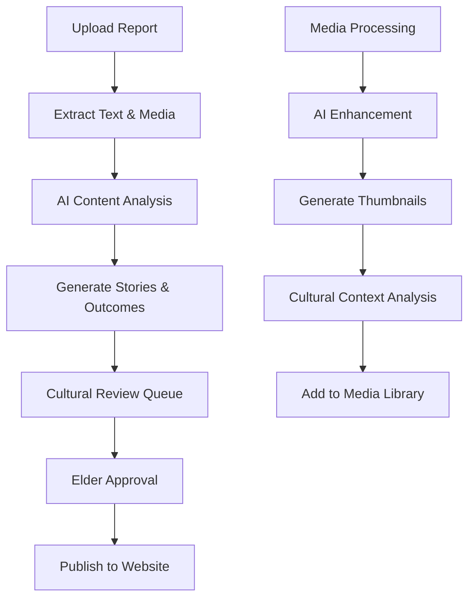

# Oonchiumpa Backend Architecture
## Automated Media Extraction & Content Management System

### 🎯 Vision
Create an intelligent backend system that automatically extracts photos, videos, and outcomes from reports, processes them with AI, and makes them easily accessible through widgets and components on the website.

---

## 🏗️ Core Architecture

### 1. **Technology Stack**
- **Runtime**: Node.js with TypeScript
- **Framework**: Express.js with Helmet, CORS, Rate Limiting
- **Database**: PostgreSQL with Prisma ORM
- **File Storage**: AWS S3 with CloudFront CDN
- **Search**: Elasticsearch for content search
- **Queue System**: Bull Queue with Redis
- **AI/ML**: OpenAI GPT-4, AWS Rekognition, Google Cloud Vision
- **Authentication**: JWT with refresh tokens
- **Monitoring**: Winston logging, Prometheus metrics
- **Deployment**: Docker containers on AWS ECS

### 2. **Database Schema**

```typescript
// Core Entities
interface Story {
  id: string;
  title: string;
  subtitle?: string;
  content: string;
  author?: string;
  category: string;
  culturalSignificance?: string;
  tags: string[];
  status: 'draft' | 'published' | 'archived';
  publishedAt?: Date;
  createdAt: Date;
  updatedAt: Date;
  
  // Relations
  mediaItems: MediaItem[];
  extractionSource?: ReportDocument;
}

interface Outcome {
  id: string;
  title: string;
  description: string;
  impact: string;
  category: string;
  location?: string;
  beneficiaries?: number;
  metrics: OutcomeMetric[];
  date?: Date;
  status: 'draft' | 'published';
  createdAt: Date;
  updatedAt: Date;
  
  // Relations
  mediaItems: MediaItem[];
  extractionSource?: ReportDocument;
}

interface MediaItem {
  id: string;
  type: 'image' | 'video';
  originalUrl: string;
  thumbnailUrl?: string;
  cdnUrl: string;
  title?: string;
  description?: string;
  altText?: string;
  tags: string[];
  metadata: MediaMetadata;
  processingStatus: 'pending' | 'processing' | 'completed' | 'failed';
  
  // AI-generated data
  aiDescription?: string;
  aiTags?: string[];
  culturalContext?: string;
  
  createdAt: Date;
  updatedAt: Date;
}

interface ReportDocument {
  id: string;
  filename: string;
  originalUrl: string;
  type: 'pdf' | 'docx' | 'txt';
  extractionStatus: 'pending' | 'processing' | 'completed' | 'failed';
  extractedData: any;
  uploadedAt: Date;
  processedAt?: Date;
}
```

---

## 🤖 AI-Powered Content Extraction System

### **1. Document Processing Pipeline**

```typescript
class DocumentProcessor {
  async processDocument(file: File): Promise<ProcessingResult> {
    // Step 1: Upload to secure storage
    const fileUrl = await this.uploadToS3(file);
    
    // Step 2: Extract text content
    const textContent = await this.extractText(fileUrl, file.type);
    
    // Step 3: AI-powered content analysis
    const analysis = await this.analyzeContent(textContent);
    
    // Step 4: Extract structured data
    const structuredData = await this.extractStructuredData(analysis);
    
    // Step 5: Process embedded media
    const mediaItems = await this.extractMedia(file);
    
    return {
      textContent,
      analysis,
      structuredData,
      mediaItems
    };
  }

  private async analyzeContent(text: string): Promise<ContentAnalysis> {
    const prompt = `
    Analyze this Aboriginal community report and extract:
    1. Stories and their cultural significance
    2. Community outcomes and impact metrics
    3. Key themes and categories
    4. Important dates and locations
    5. Beneficiary numbers and demographics
    
    Text: ${text}
    
    Return structured JSON with extracted information.
    `;
    
    return await this.openAI.analyze(prompt);
  }
}
```

### **2. Media Processing & Enhancement**

```typescript
class MediaProcessor {
  async processMedia(mediaItem: MediaItem): Promise<EnhancedMedia> {
    // Image processing
    if (mediaItem.type === 'image') {
      // Generate thumbnails
      const thumbnails = await this.generateThumbnails(mediaItem.url);
      
      // AI image analysis
      const aiDescription = await this.analyzeImage(mediaItem.url);
      
      // Cultural context detection
      const culturalContext = await this.detectCulturalElements(mediaItem.url);
      
      // Accessibility
      const altText = await this.generateAltText(mediaItem.url);
      
      return {
        ...mediaItem,
        thumbnails,
        aiDescription,
        culturalContext,
        altText
      };
    }
    
    // Video processing
    if (mediaItem.type === 'video') {
      // Generate thumbnail from video
      const thumbnail = await this.extractVideoThumbnail(mediaItem.url);
      
      // Extract audio for transcription
      const transcript = await this.transcribeVideo(mediaItem.url);
      
      // AI content analysis
      const contentAnalysis = await this.analyzeVideoContent(transcript);
      
      return {
        ...mediaItem,
        thumbnail,
        transcript,
        contentAnalysis
      };
    }
  }

  private async detectCulturalElements(imageUrl: string): Promise<CulturalContext> {
    const prompt = `
    Analyze this image for Aboriginal cultural elements:
    - Traditional symbols or patterns
    - Cultural practices or ceremonies
    - Traditional tools or artifacts
    - Country/landscape significance
    - Community activities
    
    Provide respectful, accurate cultural context.
    `;
    
    return await this.visionAI.analyze(imageUrl, prompt);
  }
}
```

---

## 📊 Content Management Dashboard

### **Admin Interface Features**
1. **Document Upload & Processing**
   - Drag-and-drop interface
   - Progress tracking for processing
   - Preview extracted content
   - Manual editing capabilities

2. **Content Review & Curation**
   - AI-suggested content with human oversight
   - Cultural sensitivity review
   - Community Elder approval workflow
   - Content scheduling and publishing

3. **Media Library Management**
   - Visual media browser
   - Bulk operations (tagging, categorization)
   - Advanced search and filtering
   - Usage analytics

4. **Widget Configuration**
   - Dynamic content widgets for website
   - Customizable display templates
   - Real-time preview
   - Performance metrics

### **Dashboard Components**

```typescript
// Widget System
interface ContentWidget {
  id: string;
  type: 'stories' | 'outcomes' | 'media-gallery' | 'video-showcase';
  configuration: WidgetConfig;
  filters: ContentFilter[];
  displayOptions: DisplayOptions;
  updateFrequency: 'real-time' | 'hourly' | 'daily';
}

interface WidgetConfig {
  maxItems: number;
  categories: string[];
  sortBy: 'date' | 'relevance' | 'impact';
  showMetadata: boolean;
  culturalSensitivityLevel: 'public' | 'community' | 'restricted';
}

// Auto-updating content feeds
class WidgetManager {
  async generateWidgetData(widgetId: string): Promise<WidgetData> {
    const widget = await this.getWidget(widgetId);
    const content = await this.getFilteredContent(widget.filters);
    
    return this.formatForDisplay(content, widget.displayOptions);
  }

  async scheduleContentUpdates(): Promise<void> {
    // Automatically refresh widgets based on new content
    // Send real-time updates to frontend via WebSockets
    // Cache generated content for performance
  }
}
```

---

## 🔄 Automated Workflows

### **1. Report Processing Workflow**


### **2. Content Syndication System**

```typescript
class ContentSyndicator {
  async syncContent(): Promise<void> {
    // Automatically create stories from outcomes
    await this.generateStoriesFromOutcomes();
    
    // Cross-reference related content
    await this.linkRelatedContent();
    
    // Generate social media previews
    await this.generateSocialPreviews();
    
    // Update search indexes
    await this.updateSearchIndexes();
  }

  async generateStoriesFromOutcomes(): Promise<Story[]> {
    const outcomes = await this.getRecentOutcomes();
    const stories = [];
    
    for (const outcome of outcomes) {
      const storyContent = await this.ai.generateStory({
        outcome,
        tone: 'respectful-celebratory',
        culturalContext: outcome.culturalContext,
        communityVoice: true
      });
      
      stories.push(await this.createStory(storyContent));
    }
    
    return stories;
  }
}
```

---

## 🎨 Dynamic Widget System

### **Frontend Integration**

```typescript
// Self-updating components
const DynamicStoriesWidget: React.FC<WidgetProps> = ({ widgetId }) => {
  const { data, loading } = useWebSocket(`/widgets/${widgetId}/stream`);
  
  return (
    <div className="stories-widget">
      {data?.stories.map(story => (
        <StoryCard key={story.id} story={story} />
      ))}
    </div>
  );
};

// Easy embedding system
const EmbedCode = `
<div id="oonchiumpa-widget" 
     data-widget-id="stories-homepage" 
     data-theme="cultural">
</div>
<script src="/widgets/embed.js"></script>
`;
```

### **API Endpoints**

```typescript
// Dynamic content endpoints
app.get('/api/widgets/:id/data', async (req, res) => {
  const widgetData = await widgetManager.generate(req.params.id);
  res.json(widgetData);
});

app.post('/api/reports/upload', upload.single('report'), async (req, res) => {
  const job = await documentProcessor.process(req.file);
  res.json({ jobId: job.id, status: 'processing' });
});

app.get('/api/processing-status/:jobId', async (req, res) => {
  const status = await processingQueue.getStatus(req.params.jobId);
  res.json(status);
});

// Real-time updates
io.on('connection', (socket) => {
  socket.on('subscribe-widget', (widgetId) => {
    socket.join(`widget-${widgetId}`);
  });
  
  // Auto-emit updates when content changes
  contentEmitter.on('content-updated', (data) => {
    io.to(`widget-${data.widgetId}`).emit('content-update', data);
  });
});
```

---

## 🚀 Implementation Phases

### **Phase 1: Foundation (Weeks 1-3)**
- [ ] Set up core backend infrastructure
- [ ] Implement basic document processing
- [ ] Create database schema and API endpoints
- [ ] Build simple admin dashboard

### **Phase 2: AI Integration (Weeks 4-6)**
- [ ] Integrate OpenAI for content analysis
- [ ] Add image/video processing capabilities
- [ ] Implement cultural context detection
- [ ] Create content review workflows

### **Phase 3: Advanced Features (Weeks 7-9)**
- [ ] Build dynamic widget system
- [ ] Add real-time content updates
- [ ] Implement search and filtering
- [ ] Create automated content syndication

### **Phase 4: Polish & Scale (Weeks 10-12)**
- [ ] Performance optimization
- [ ] Security hardening
- [ ] Monitoring and analytics
- [ ] User training and documentation

---

## 🔒 Security & Cultural Considerations

### **Data Protection**
- Encrypted storage for sensitive cultural content
- Role-based access control (Public, Community, Elder, Admin)
- Audit trails for all content modifications
- GDPR/privacy compliance

### **Cultural Sensitivity**
- Elder review process for all cultural content
- Sensitivity level tagging
- Community consent tracking
- Traditional knowledge protection protocols

### **Performance & Scalability**
- CDN for global media delivery
- Redis caching for frequently accessed content
- Database indexing for search performance
- Horizontal scaling with load balancers

---

This architecture creates a seamless flow from uploaded reports to beautiful, culturally-sensitive website content, with AI assistance and human oversight ensuring quality and cultural appropriateness at every step! 🎨✨